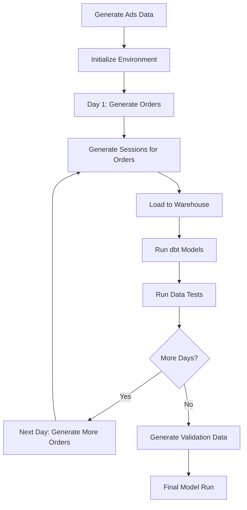

# Demo Data Generation System

This document explains how the Jaffle Shop Goes Online demo data generation system works. This system creates realistic synthetic e-commerce data for demonstrating data pipelines, marketing attribution, and data quality monitoring.

## What It Does

The system generates interconnected datasets that simulate a real e-commerce business with marketing attribution:

- **Customer lifecycle data**: Signups, orders, payments
- **Marketing attribution data**: Sessions, ad campaigns, conversions
- **Time-series simulation**: Daily data pipeline with realistic patterns
- **Data quality scenarios**: Includes anomalies and edge cases for testing

## Training vs Validation Data

The system generates two parallel datasets:

### Training Data

- **Purpose**: Represents your "normal" production data pipeline
- **Usage**: Daily pipeline simulation, baseline for analytics
- **Pattern**: Consistent, realistic business patterns
- **Files**: `raw_*_training.csv`

### Validation Data

- **Purpose**: Represents "new" or "test" data for quality monitoring
- **Usage**: Data quality testing, anomaly detection, pipeline validation
- **Pattern**: May include anomalies, edge cases, or different patterns
- **Files**: `raw_*_validation.csv`

### Why Both?

This dual-dataset approach enables testing of:

- **Data drift detection**: Compare validation vs training patterns
- **Anomaly detection**: Validation data may contain outliers
- **Pipeline robustness**: Ensure models handle different data characteristics
- **Data quality monitoring**: Elementary and other tools compare datasets

During simulation:

1. **Training data** runs through the daily pipeline continuously
2. **Validation data** is processed occasionally to simulate new data arriving
3. **Data quality tests** compare the two datasets for anomalies

## Quick Start

### Prerequisites

- Python 3.9+
- dbt installed with your warehouse adapter (Snowflake, BigQuery, etc.)
- dbt profiles configured

### Basic Usage

```bash
# Install the project
pip install -e .

# Generate all data and run full demo
python cli.py initial-incremental-demo-flow --days-back 8

# Generate specific data types only
python cli.py generate-new-data --data-to-generate ads
python cli.py generate-new-data --data-to-generate training
python cli.py generate-new-data --data-to-generate validation
```

## System Architecture

### Core Components

```
data_creation/
├── incremental_data_creation/          # Main data generation
│   ├── incremental_data_flow.py       # Orchestrates daily simulation
│   ├── training_data_generator.py     # Core business data
│   ├── validation_data_generator.py   # Validation datasets
│   ├── sessions_data_generator.py     # Marketing attribution
│   ├── ads_data_generator.py          # Ad campaign data
│   └── original_jaffle_shop_data/     # Base seed data
├── data_injection/                     # dbt test data injection
└── initial_demo.py                     # Main entry point
```

### Generated Data Types

**Core Business Data** (CSV seeds):

- `raw_customers_training.csv` / `raw_customers_validation.csv` - Customer profiles
- `raw_orders_training.csv` / `raw_orders_validation.csv` - Order transactions
- `raw_payments_training.csv` / `raw_payments_validation.csv` - Payment records
- `raw_signups_training.csv` / `raw_signups_validation.csv` - User registrations

**Marketing Attribution Data**:

- `stg_app_sessions.csv` - Mobile app sessions (IDs: `a1`, `a2`, ...)
- `stg_website_sessions.csv` - Website sessions (IDs: `w1`, `w2`, ...)
- `stg_google_ads.csv` - Google advertising campaigns
- `stg_facebook_ads.csv` - Facebook advertising campaigns
- `stg_instagram_ads.csv` - Instagram advertising campaigns

## Key Design Principles

### 1. Realistic Temporal Relationships

- Marketing sessions occur 1-24 hours **before** customer orders
- 70% same-day conversions, 30% next-day conversions
- Attribution windows: 1-day (local testing) or 7-day (CI/production)

### 2. Marketing Attribution Logic

- Each customer has exactly one attribution session (typical for jaffle shop)
- Platform preferences: Website → Google/Facebook, App → Facebook/Instagram
- Sessions link to specific ad campaigns via `ad_id`

### 3. Incremental Data Pipeline Simulation

```python
# Daily simulation pattern:
for each_day in simulation_period:
    1. Generate new business data for that day
    2. Generate marketing sessions aligned with orders
    3. Load data into warehouse (dbt seed)
    4. Run analytics models (dbt run)
    5. Execute data quality tests (dbt test)
    6. Occasionally process validation data
```

## Data Flow



## CLI Reference

### Main Commands

```bash
# Full incremental demo simulation
python cli.py initial-incremental-demo-flow [OPTIONS]

# Generate specific data types
python cli.py generate-new-data --data-to-generate {training|validation|marketing|ads|all}
```

### Options

- `--days-back N`: Number of days to simulate (default: 30)
- `--target TARGET`: dbt target environment
- `--profiles-dir PATH`: dbt profiles directory
- `--data-to-generate TYPE`: Which data to generate

### Examples

```bash
# Quick 8-day demo
python cli.py initial-incremental-demo-flow --days-back 8

# Generate just marketing data
python cli.py generate-new-data --data-to-generate marketing

# Use specific dbt target
python cli.py initial-incremental-demo-flow --target production --days-back 5
```

## Automated Pipeline (CI/CD)

The system runs automatically via GitHub Actions:

- **Schedule**: Daily at 03:20 UTC
- **Manual**: On-demand via workflow_dispatch
- **Process**:
  1. Generate ads data first
  2. Run incremental demo flow
  3. Upload generated CSVs as artifacts

## Data Characteristics

### Volume

- **Customers**: ~2,000 training + ~200 validation per run
- **Orders**: ~15,000 training + ~1,500 validation per run
- **Sessions**: ~3,000 app + website sessions per run
- **Ads**: ~14,000 campaign records across platforms

### Patterns

- **Seasonality**: Gradual growth over time with random fluctuations
- **Customer behavior**: Realistic order patterns, payment methods
- **Marketing attribution**: Single-touch attribution model
- **Data quality**: Includes anomalies for testing data quality tools

## Understanding the Output

### Successful Run

When complete, you'll have:

- Populated seed tables in your warehouse
- dbt models built with time-series data
- Marketing attribution analysis available
- Data quality test results

### Key Models Generated

- `customers` - Customer dimension with lifetime value
- `orders` - Order facts with payments
- `customer_conversions` - Marketing attribution analysis
- `sessions` - Combined app + website sessions
- Various marketing analysis tables

## Configuration

### Attribution Window

Set in `dbt_project.yml`:

```yaml
vars:
  conversion_window_days: 1 # or 7 for production
```

### Data Volume

Modify constants in generator files:

- `CUSTOMERS_AMOUNT` - Number of customers per run
- `ORDERS_PER_CUSTOMER_*` - Order frequency ranges
- `SESSIONS_PER_CUSTOMER_*` - Session frequency ranges

## Development

### Adding New Data Types

1. Create generator in `data_creation/incremental_data_creation/`
2. Add CLI command in `cli.py`
3. Integrate into `incremental_data_flow.py`
4. Add seed configuration in `jaffle_shop_online/models/seeds.yml`

### Extending Attribution Logic

- Modify `sessions_data_generator.py` for new attribution patterns
- Update `customer_conversions` model for multi-touch attribution
- Add new UTM parameters or campaign types

### Testing Changes

```bash
# Test data generation only (no dbt)
python -m data_creation.incremental_data_creation.training_data_generator

# Test specific components
python -m data_creation.incremental_data_creation.sessions_data_generator

# Run quick demo
python cli.py initial-incremental-demo-flow --days-back 3
```

---

This system provides a comprehensive foundation for demonstrating modern data pipelines, attribution modeling, and data quality monitoring with realistic e-commerce patterns.
